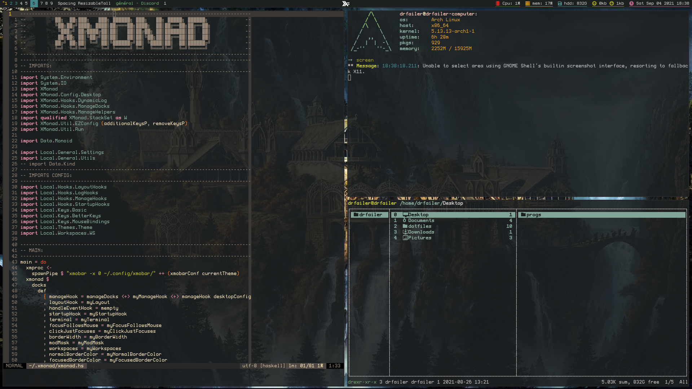
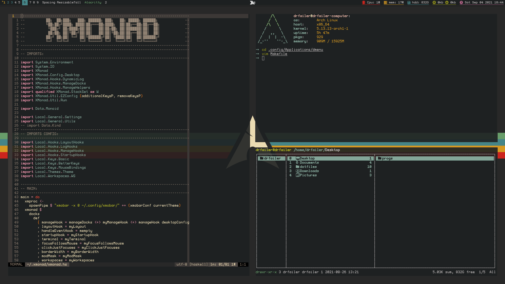

# XMonad config

## My applications

- xmonad
- xmonad-contribs
- xmobar
- dmenu
- ranger
- neomutt
- calcurse
- ytop/htop
- sxiv
- zathura

## keybings

| Key        | Effect                                         |
|:-----------|:-----------------------------------------------|
| M-p        | run prompt                                     |
| M-S-p x    | xmonad prompt                                  |
| M-S-p m    | man prompt                                     |
| M-f        | search prompt                                  |
| M-S-p s    | sound prompt                                   |
| M-S-p f    | config edit prompt                             |
| M-S-p c    | calculator prompt                              |
| M-S-p b    | brightness prompt (laptop config)              |
| M-S-q      | quit                                           |
| M-q        | recompile and restart                          |
| M-s        | refresh                                        |
| M-S-c      | kill (close focused window)                    |
| M-b        | toggle xmobar                                  |
| M-<Tab>    | windows focusDown                              |
| M-j        | windows focusDown                              |
| M-k        | windows focusUp                                |
| M-m        | windows focusMaster                            |
| M-<Return> | windows swapMaster                             |
| M-t        | toggle float                                   |
| M-S-h      | inc master sink (more windows in master place) |
| M-S-l      | dec master sink                                |
| M-S-j      | windows swapDown                               |
| M-S-k      | windows swapUp                                 |
| M-M1-h     | Shrink (horizontally)                          |
| M-M1-l     | Expand (horizontally)                          |
| M-M1-j     | MirrorShrink (vertically)                      |
| M-M1-k     | MirrorExpand (vertically)                      |
| M-S-C-l    | withFocused keysResizeWindow                   |
| M-S-C-h    | withFocused keysResizeWindow                   |
| M-S-C-k    | withFocused keysResizeWindow                   |
| M-S-C-j    | withFocused keysResizeWindow                   |
| M-C-h      | move float window on left                      |
| M-C-j      | move float window on down                      |
| M-C-k      | move float window on up                        |
| M-C-l      | move float window on right                     |
| M-d        | launch ranger                                  |
| M-S-a c    | launch calcurse                                |
| M-S-a m    | launch neomutt                                 |
| M-S-a y    | launch ytop                                    |
| M-S-a f    | launch firefox                                 |
| M-S-a q    | launch qutebrowser                             |
| M-n r      | read notes (dm script)                         |
| M-n e      | edit notes (dm script)                         |
| M-i        | inc window spacing                             |
| M-u        | dec window spacing                             |
| M-S-i      | inc screen spacing                             |
| M-S-u      | dec screen spacing                             |
| M-S-b      | toggle spacing                                 |

## Images

